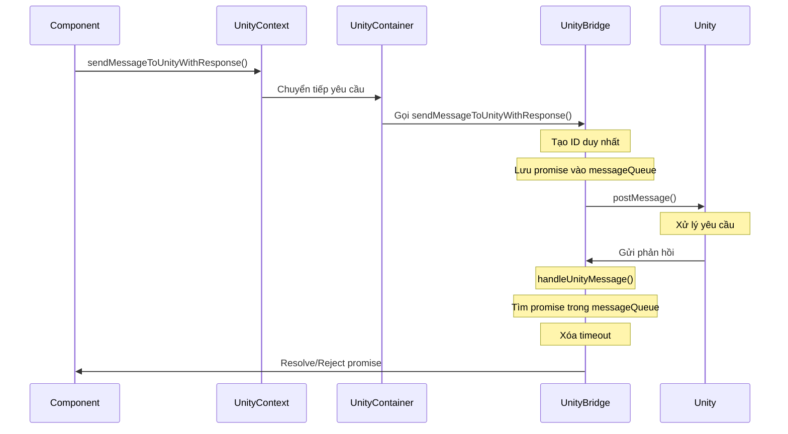

# Luồng giao tiếp giữa React Native và Unity

## 1. Gửi yêu cầu từ React Native đến Unity



### Chi tiết các bước:

1. **Component gọi hàm sendMessageToUnityWithResponse()**
   - Component sử dụng hook useUnity để lấy hàm gửi tin nhắn
   - Chuẩn bị message với type và payload

2. **UnityContext chuyển tiếp yêu cầu**
   - Cung cấp context cho toàn bộ ứng dụng
   - Quản lý trạng thái hiển thị Unity view

3. **UnityContainer xử lý yêu cầu**
   - Khởi tạo và quản lý UnityView
   - Chuyển tiếp tin nhắn đến UnityBridge

4. **UnityBridge xử lý và gửi tin nhắn**
   - Tạo ID duy nhất cho tin nhắn
   - Lưu promise handlers vào messageQueue
   - Thiết lập timeout 30 giây
   - Gửi tin nhắn đến Unity qua postMessage()

## 2. Nhận phản hồi từ Unity

### Chi tiết các bước:

1. **Unity gửi phản hồi**
   - Xử lý yêu cầu và chuẩn bị dữ liệu phản hồi
   - Gửi phản hồi với cùng ID

2. **UnityBridge xử lý phản hồi**
   - Nhận và parse dữ liệu JSON
   - Tìm promise tương ứng trong messageQueue
   - Xóa timeout đã thiết lập
   - Xóa promise khỏi messageQueue

3. **Resolve hoặc Reject promise**
   - Nếu status = 'success': resolve với payload
   - Nếu status khác: reject với payload
   - Component nhận được kết quả

## 3. Định dạng tin nhắn

### Gửi từ RN sang Unity:
```json
{
  "id": "unique_id_123",
  "type": "action_type",
  "payload": {
    "key": "value"
  }
}
```

### Phản hồi từ Unity:
```json
{
  "id": "unique_id_123",
  "type": "action_type",
  "payload": {
    "status": "success",
    "result": "data"
  }
}
```

## 4. Xử lý lỗi

1. **Timeout**
   - Sau 30 giây không nhận được phản hồi
   - Promise bị reject với lỗi "Unity response timeout"

2. **Lỗi parse JSON**
   - Ghi log lỗi
   - Không gửi phản hồi về RN

3. **Lỗi xử lý**
   - Gửi phản hồi với status khác success
   - Kèm thông báo lỗi trong result